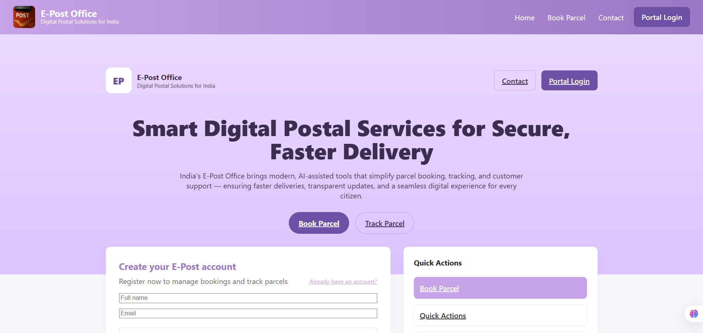
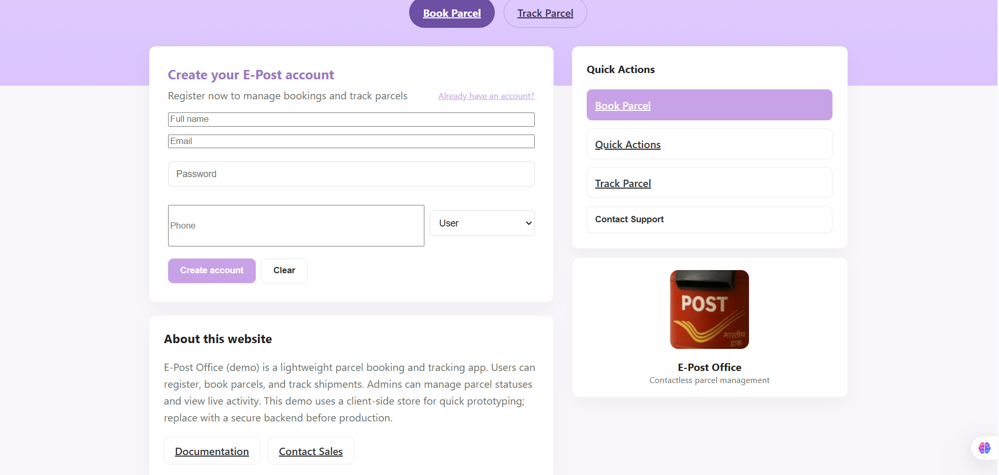
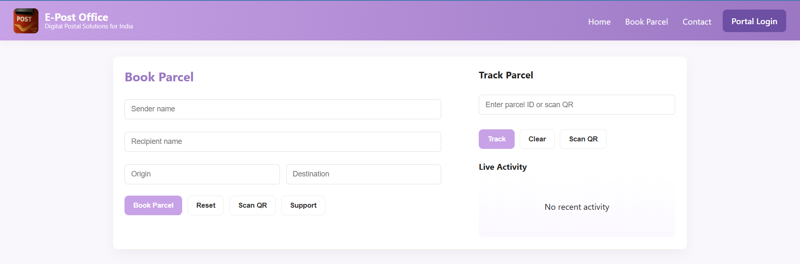
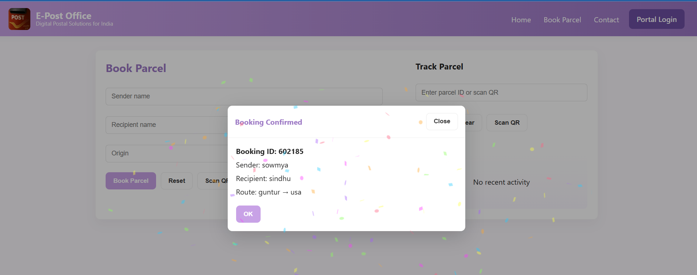
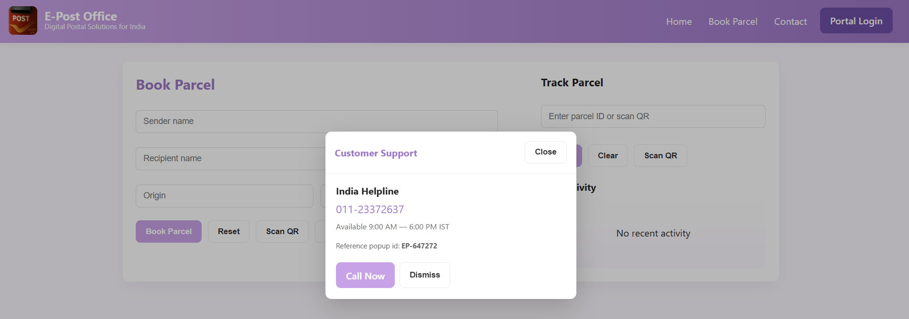
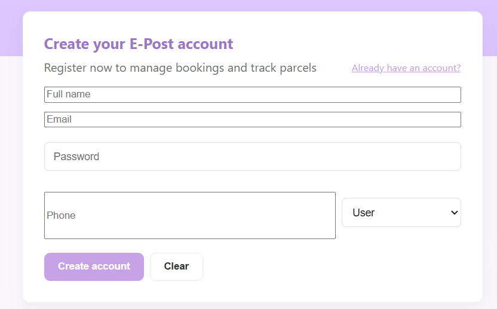
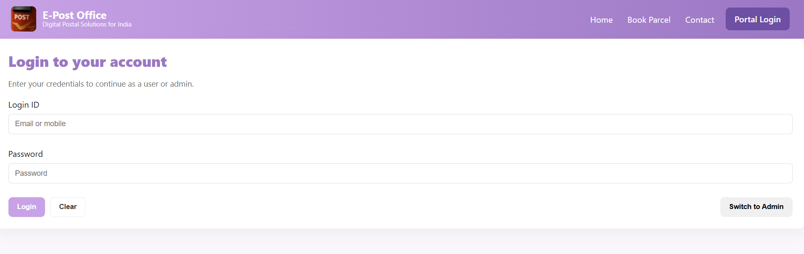

# 📮 E-Post Office Management System

A full-stack postal service platform built using **MERN Stack (MongoDB, Express.js, React.js, Node.js)**.  
This system allows users to **book parcels, track shipments, scan QR codes, access support**, and perform **admin parcel updates** — all with a modern lavender-themed UI.

---

## 🖼️ Application Screenshots

### 🏠 Homepage  


### 🎉 Parcel Booking (with confetti popup)  


### 🔎 Track Parcel (Manual + QR Scan)  


### 📷 QR Scanner  


### 🧭 Quick Actions Dashboard  


### 👤 User Dashboard  


### 🛠 Admin Dashboard  


---

## 🚀 Features

- 📦 **Book Parcels** — Register parcels with auto-generated Parcel IDs  
- 🔎 **Track Parcels** — Using Parcel ID or **Live QR Scanner**  
- 📷 **QR Code Scanner** — Camera-based instant parcel lookup  
- 🔐 **User & Admin Login** — Role-based authentication  
- 📨 **Admin Controls** — Update parcel status (In Transit / Delivered / Returned)  
- 🎉 **Interactive UI** — Confetti, modals, popups, animations  
- 🧭 **Quick Actions Page** — Big buttons for core actions  
- ☎️ **Support Popup** — India helpline + unique popup reference  
- 🟣 **Lavender postal-themed interface**  
- 📱 Fully responsive layout  

---

## 🧰 Tech Stack Used

| Layer | Technologies |
|-------|--------------|
| **Frontend** | React.js, React Router DOM, Axios, HTML5 QR Scanner, Canvas-Confetti, CSS |
| **Backend** | Node.js, Express.js |
| **Database** | LocalStorage (Demo) / MongoDB Atlas (Production Ready) |
| **Other Tools** | Git, VS Code, Railway / Render / Vercel |

---

## 🖥️ Setup Instructions

```bash
# Clone the repository
git clone <your-repository-url>
cd e-post-office

# Backend Setup
cd backend
npm install
npm run dev

# Frontend Setup
cd ../frontend
npm install
npm start
